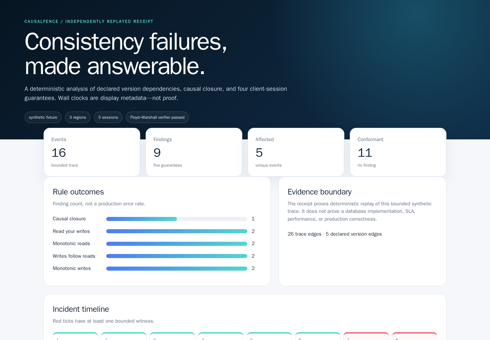
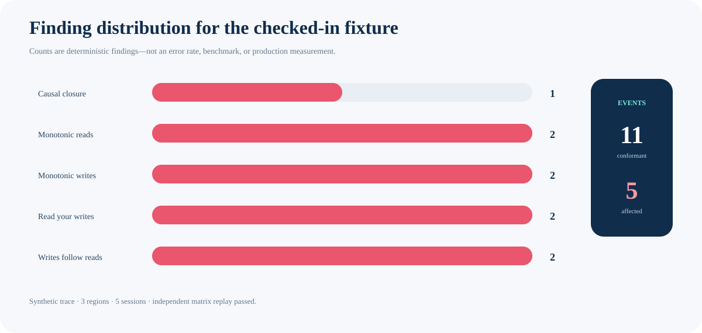
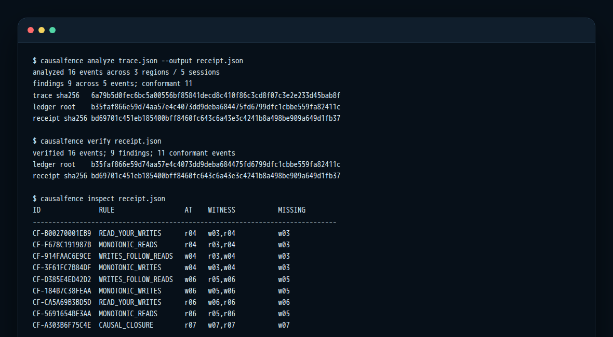
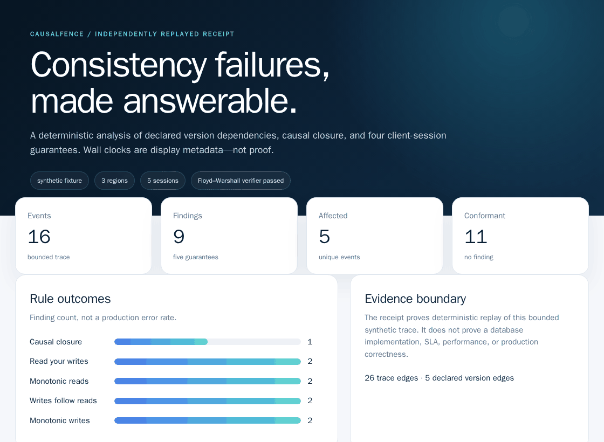
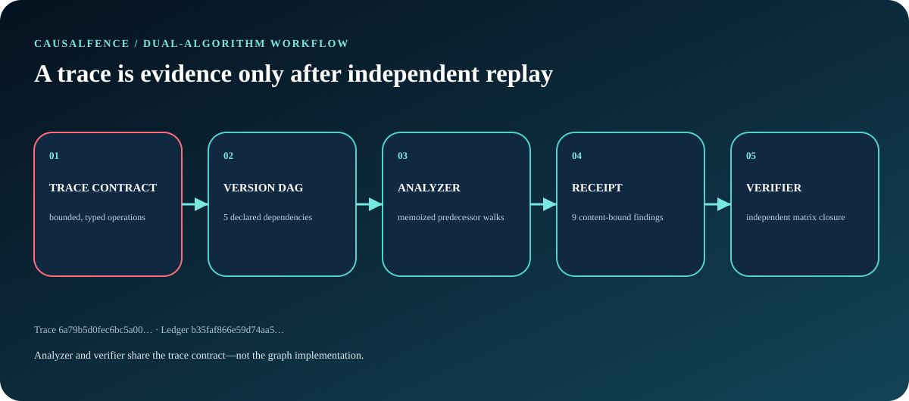
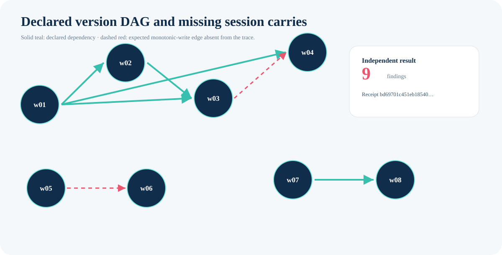
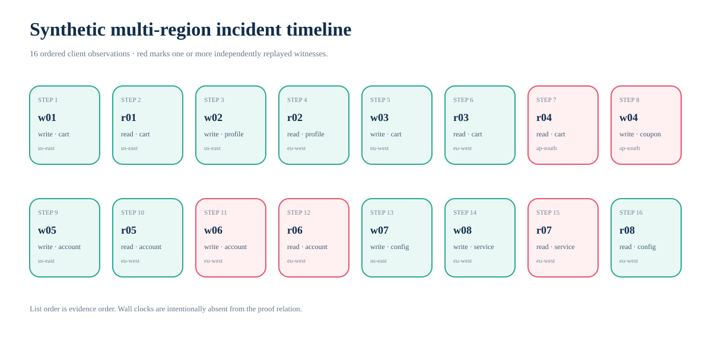
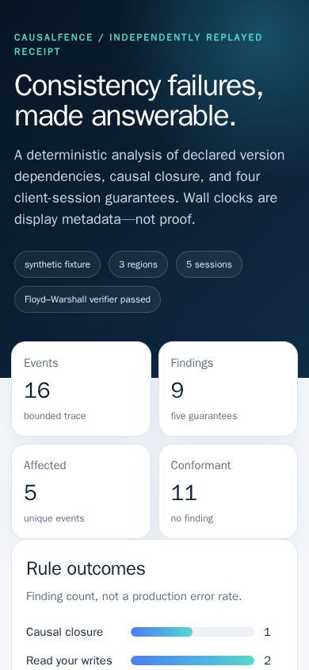

# CausalFence

**Deterministic conformance receipts for causal and session guarantees in
bounded multi-region key-value traces.**

CausalFence turns a client-visible trace into explicit version relations,
bounded violation witnesses, and a hash-chained receipt. A second implementation
reconstructs the relation with Floyd–Warshall and rejects any receipt field it
cannot reproduce.

  

The screenshot above is generated from the checked-in
[synthetic incident](scenarios/multi-region-incident.json), not a mockup. Its
HTML, responsive captures, CLI transcript, diagrams, GIF, receipt, hashes, and
generation environment are bound by the
[evidence manifest](docs/evidence/causalfence-evidence.json).

## Why this exists

Distributed traces can show that a client observed an impossible or regressive
history without justifying a broad claim about the underlying database.
CausalFence keeps that boundary explicit:

- validate an exact, bounded trace contract;
- derive declared version ancestry without trusting wall-clock time;
- check causal closure and four client-session guarantees;
- identify a deterministic local witness for each finding;
- chain every normalized event and finding into a SHA-256 ledger;
- verify the complete receipt with code that does not import the analyzer,
  graph builder, ledger, or engine.

The runtime has no dependencies and performs no network requests, database
connections, model calls, plugins, or code execution from trace fields.

## Verified reference result

The public fixture is synthetic and deliberately contains valid and invalid
histories.

| Result | Verified value |
|---|---:|
| Events | 16 |
| Writes / reads | 8 / 8 |
| Regions / sessions | 3 / 5 |
| Declared version edges / complete trace edges | 5 / 26 |
| Findings / affected events / conformant events | 9 / 5 / 11 |
| Test suite | 60 tests |
| Measured line coverage | 97.78% |
| Python compatibility | 3.11.15, 3.12.13, 3.13.14, 3.14.6 |

Rule counts are one causal-closure finding and two findings each for
read-your-writes, monotonic reads, writes-follow-reads, and monotonic writes.

  

These are fixture findings, not a production error rate or benchmark.

## Quick start

~~~bash
git clone https://github.com/omar07ibrahim/causalfence.git
cd causalfence
python -m venv .venv
. .venv/bin/activate
python -m pip install .
~~~

Run the complete installed-CLI workflow:

~~~bash
causalfence analyze scenarios/multi-region-incident.json --output receipt.json
causalfence verify receipt.json
causalfence inspect receipt.json
causalfence report receipt.json --output report.html
~~~

Outputs use exclusive creation: CausalFence refuses to replace an existing
receipt or report.

  

The exact text capture is
[`causalfence-cli.txt`](docs/evidence/causalfence-cli.txt).

## Workflow

  

1. **Contract:** parse at most 512 KiB of duplicate-key-free UTF-8 JSON and
   accept at most 256 strictly ordered events.
2. **Normalize:** preserve only exact event fields and canonical JSON.
3. **Relate:** build declared write-version ancestry; separately retain session,
   context, and read-from evidence edges.
4. **Analyze:** check five guarantees with memoized predecessor sets.
5. **Receipt:** bind trace, relation, findings, summary, and an append-only
   event/finding ledger.
6. **Verify:** rebuild version reachability with a Floyd–Warshall matrix and
   compare every receipt field.

  

See [architecture](docs/architecture.md) for exact relations, algorithms, and
the complexity boundary.

## Guarantees checked

| Rule | Question answered by this trace |
|---|---|
| Causal closure | Does an event omit an ancestor of a version it presents or observes? |
| Read your writes | Does a read include the session's latest prior same-key write? |
| Monotonic reads | Does a later same-key read move behind the last observed version? |
| Writes follow reads | Does a write carry versions previously observed by its session? |
| Monotonic writes | Does a later session write descend from its preceding write? |

A finding names its event, session, key, witness events, missing versions, and a
content-bound ID. “Witness” means a deterministic local justification under the
declared contract, not a globally smallest counterexample.

  

The field schema and reference rules are in the
[trace contract](docs/trace-contract.md).

## Incident evidence

The timeline is rendered from all 16 normalized events. Red operations have one
or more independently replayed findings.

  

The report is also checked at a 390 × 844 viewport:

  

The [full 1440 × 3162 capture](docs/evidence/causalfence-report-full.png) shows
the timeline, all nine findings, all normalized events, and complete digests.

## Receipt integrity

For the checked-in fixture:

- trace SHA-256:
  `6a79b5d0fec6bc5a00556bf85841decd8c410f86c3cd8f07c3e2e233d45bab8f`
- ledger root:
  `b35faf866e59d74aa57e4c4073dd9deba684475fd6799dfc1cbbe559fa82411c`
- receipt SHA-256:
  `bd69701c451eb185400bff8460fc643c6a43e3c4241b8a498be909a649d1fb37`

The [complete receipt](docs/evidence/causalfence-receipt.json) contains the
normalized trace, declared relation, findings, summary, 25 ledger entries, and
all digests. Mutation tests cover summary, relation, witness, ledger, root,
trace digest, and receipt digest tampering.

## Reproduce the checks

~~~bash
python -m pip install --no-deps --require-hashes -r requirements/quality.txt
python -m pip install --no-build-isolation --no-deps .
python -m ruff check .
python -m ruff format --check .
python -m mypy
python -m pytest -q --cov=causalfence --cov-report=term-missing
~~~

CI also builds and inspects a wheel, installs it in a clean environment outside
the checkout, and runs analyze/verify/inspect/report there.

Visual evidence is generated by
[`.github/workflows/evidence.yml`](.github/workflows/evidence.yml) with Python
3.14.6, Playwright 1.62.0, Pillow 12.3.0, Chromium 151.0.7922.34, hash-locked
wheels, and a digest-pinned Linux/amd64 image. Browser capture is networkless,
read-only, capability-dropped, and resource-bounded. The job checks file hashes,
dimensions, SVG structure, three distinct GIF frames, sensitive markers, HTML
replay, and independent receipt verification. See the
[evidence method](docs/evidence-method.md).

## Evidence inventory

| Artifact | What it demonstrates |
|---|---|
| [Desktop report](docs/evidence/causalfence-report.png) | Real 1440 × 1000 rendering |
| [Mobile report](docs/evidence/causalfence-report-mobile.png) | Real responsive 390 × 844 rendering |
| [Full report](docs/evidence/causalfence-report-full.png) | Every report section |
| [Animated demo](docs/evidence/causalfence-demo.gif) | Three distinct report positions |
| [CLI image](docs/evidence/causalfence-cli.png) | Installed commands, witnesses, and hashes |
| [Architecture](docs/evidence/architecture.svg) | Dual-algorithm evidence flow |
| [Version model](docs/evidence/consistency-model.svg) | Declared and missing dependencies |
| [Timeline](docs/evidence/incident-timeline.svg) | All events and affected operations |
| [Finding chart](docs/evidence/finding-distribution.svg) | Exact per-rule fixture counts |
| [HTML report](docs/evidence/causalfence-report.html) | Self-contained replayed report |
| [Receipt](docs/evidence/causalfence-receipt.json) | Trace, relation, findings, and ledger |
| [Manifest](docs/evidence/causalfence-evidence.json) | Source/toolchain hashes and dimensions |

## Claim boundary

CausalFence proves that its two implementations agree on the declared semantics
of a bounded supplied trace. It does **not** prove that:

- trace producers are truthful, complete, or correctly instrumented;
- a specific database is causally consistent;
- the fixture represents production traffic;
- a finding is a globally minimal counterexample;
- throughput, latency, availability, or storage was measured;
- the system is a formal proof assistant, compliance control, or certification.

Wall-clock timestamps are intentionally outside the proof relation. Context and
observed-version fields remain caller assertions.

## Repository map

- [`src/causalfence/`](src/causalfence/) — runtime and independent verifier
- [`tests/`](tests/) — contract, semantics, CLI, and mutation tests
- [`scenarios/`](scenarios/) — synthetic fixture
- [`docs/evidence/`](docs/evidence/) — 13 reproducible evidence files
- [`tools/capture_evidence.py`](tools/capture_evidence.py) — evidence pipeline
- [`legacy/dtk-lpr-2025/`](legacy/dtk-lpr-2025/) — frozen original upload

The original 2025 DTK LPR files remain byte-identical and are recorded in a
[SHA manifest](legacy/dtk-lpr-2025/manifest.json). They are unsupported,
excluded from packaging and analysis, and not relicensed by CausalFence.

## Security and license

Report vulnerabilities through GitHub private vulnerability reporting; see
[SECURITY.md](SECURITY.md). New CausalFence work is Apache-2.0 licensed. The
legacy snapshot and third-party DTK rights are explicitly excluded in
[NOTICE](NOTICE).
